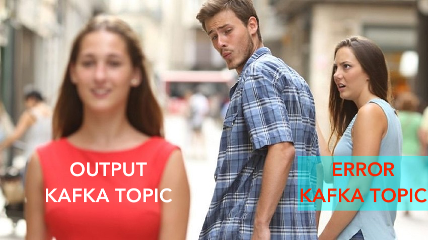
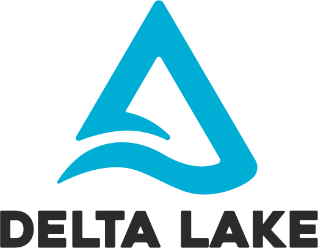
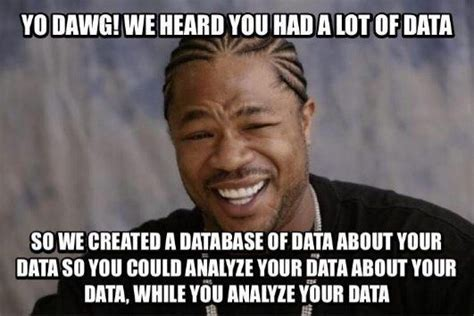

# WASP
Bologna Big Data meetup

3rd March 2020 @ LuogoComune

---

## Agenda

- What is WASP
- Use cases
- Features
- Upcoming Features

---

## What is WASP

---

## Use cases

--

### Data Ingestion

--

### Data Transformation

--

### Kappa-Lambda Architecture

--

### Machine Learning

---

## Features...

- Architectural Correctness
- Monitoring
- High Availability
- `Either[Dev, Ops]`
- Producers
- RT-consumers

--

## Features...

- Spark as a Service
- Schema Registry Integration
- Avro Encode Decode
- Multi Data stores
- Kafka Multi Topic Writer
- Spark State Manager

--

### Architectural Correctness

--

### Monitoring

--

### High Availability

--

### Either[Dev, Ops]

--

### Producers

--

### RT-consumers

--

### Spark as a Service

--

### Schema Registry Integration

code-free Darwin usage

--

### Spark State Evolution

#### When you try to add a field to the spark state

--

### Multi Data stores

- Configuration driven Data store
- Configuration driven Data format

(Things can go wrong)™

--

### Kafka Multi Topic Writer

--

### Spark State Manager

- Change parallelism of a query
- Change format/content of the state

---

## Upcoming features

--

--

## Apache Flink

--

## UI for better UX

- [ ] 🤓 REST is for NERDS

- [ ] 😎 UI are for everyone

--

## GDPR module

- Configuration driven data discovery

- Configuration driven data deletion

--

## Data (Lake) Catalog

--

## Kafka Batch Writer

---

## Questions ?

