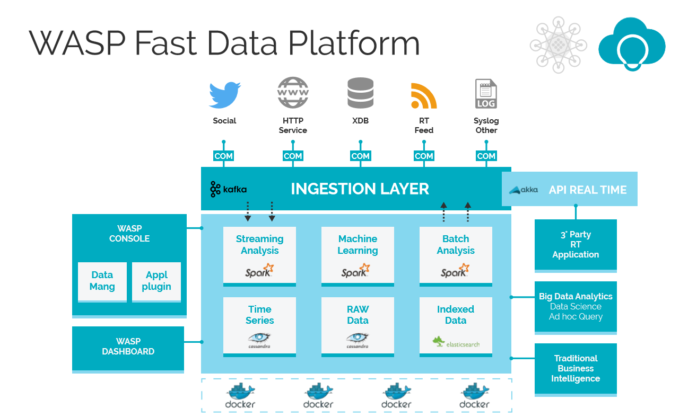
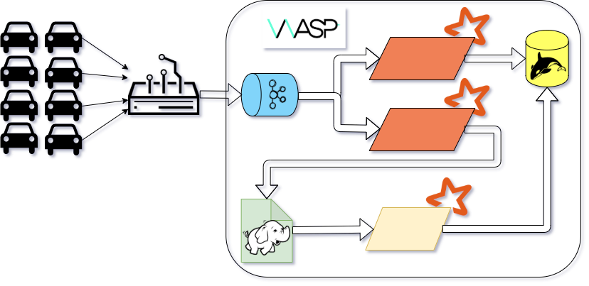
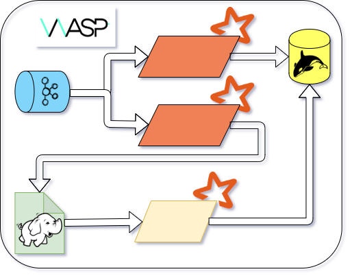
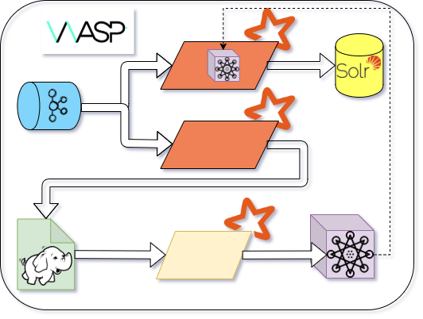

# WASP

Bologna Big Data meetup

9th April 2020 @ Home

---

#### Speaker

Antonio Murgia

**BIG** Data Engineer @ AgileLab

---

# Agenda

- What is WASP
- Use cases
- Features
- Upcoming Features

---

# What is WASP

WASP is a big data **platform** that allows you to not **waste time** with devops architectures and integrating different components. 

WASP lets you **focus** on your data, business logic and algorithms, without worrying about tipical big data problems.

--

--

# Production Ready

WASP empowers **multiple** mission critical use cases

- running in production since 2017 🚀
- handles real-time streams from hundreds of thousands of devices

--

# Wide

- Real Time
- Near Real Time
- Batch
- Pluggable Datastore

--

# Analytics

- Iterative
- Real Time
- Windowed Aggregations

--

# Streaming

- at least once or exactly once delivery
- periodically training a machine learning model
- publishing your results in real time, to be reactive
- feeding different datastores from the same data flow in a safe way

--

# Platform

Not just a "library" but a simplified __way__ for:
- running
- managing
- monitoring

**mixed** Big Data workloads

---

# Use cases

--

### IoT

--

### Kappa-Lambda Architecture

--

### Machine Learning

---

# Features...

- Encourages Architectural Correctness
- Monitoring
- High Availability
- `Either[Dev, Ops]`
- Producers
- RT-consumers

--

# Features...

- Spark as a Service
- Schema Registry Integration
- Avro Encoder
- Multi Data stores
- Kafka Multi Topic Writer
- Spark State Manager

--

### Architectural Correctness

- Wrong architectural choices are **difficult**
- Encourages process de-coupling
- ...

--

### Monitoring

- Opt-in automatic timestamping of data
- Kafka backlog monitoring from Spark Streaming Queries
- Throughput metrics

--

### High Availability

1. "roles"are Akka cluster singletons
1. Automatic recover
1. Close-to-zero downtime
   - even if multiple nodes fail

--

### Either[Dev, Ops]

- Code agnostic from data format
- Clear distinction between
  - business logic
  - physical boundaries

--

### Producers

- Auto-generate data
- Reply events from storage
- Lightweight recurrent tasks

--

### RT-consumers

- Akka Actors
- Suitable for Low Latency
- Lower througput than Spark Streaming

--

### Spark as a Service

- Start/Stop streaming processing from REST API
- Start/Monitor batch processing from REST API
- Resource sharing between Spark Jobs

--

### Schema Registry Integration

Seamless darwin integration

--

### Avro Encoder

- available before spark 2.4
- opt-in single object encoding
- Spark codegen

--

### Spark State Evolution

#### When you try to add a field to the spark state

--

### Multi Data stores

- Configuration driven Data store
- Configuration driven Data format

(Things can go wrong)™

--

### Kafka Multi Topic Writer

--

### Spark State Manager

- Scale ⬆️ stateful streaming query
- Scale ⬇️ stateful streaming query
- Change format/content of the state 

*without data loss

---

# Upcoming features

---

---

## Apache Flink

---

## UI for better UX

- 🤓 REST is for NERDS

- 😎 UI are for everyone

---

## GDPR module

- Configuration driven data discovery

- Configuration driven data deletion

---

## Data (Lake) Catalog

---

# Questions ?

